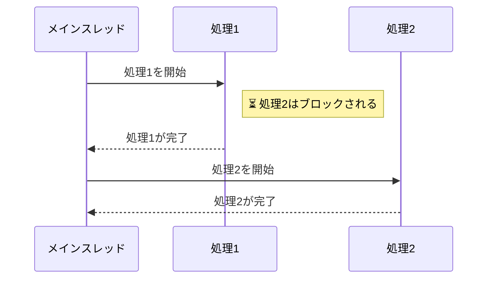
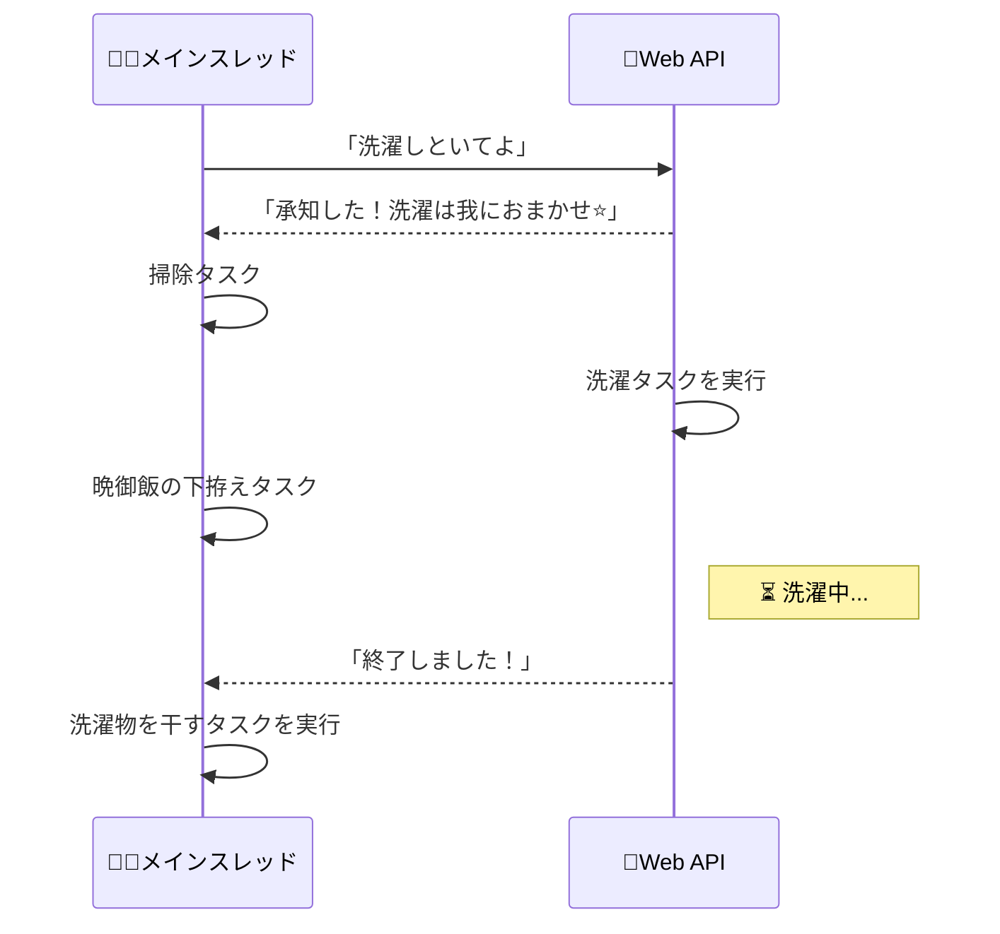
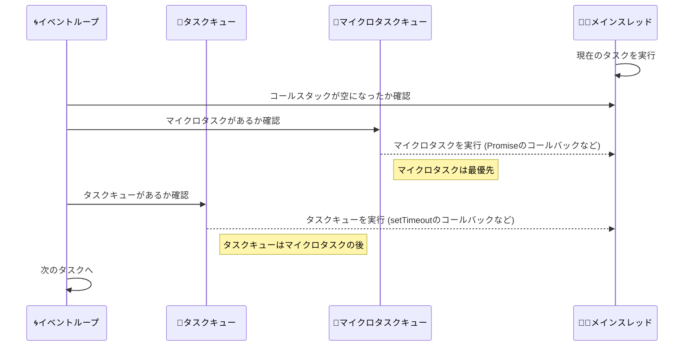

## 👩‍🦱 「はぁーーー忙しい、今日もやるわよ」

**非同期処理、それはママの日常と同じである。(知らんけど)**

:::note info
- 本記事はジュニアエンジニアの学習アウトプット記事であり、記事の対象者もJavaScript初学者を想定しています
- 基礎から整理しているため長いです。適宜読み飛ばしてください
- 本記事はブラウザ上で動くフロントエンドのJavaScriptを主に記載しています。Node.jsなどバックエンド環境では仕様に違いがあるためご注意ください
- 訂正・マサカリは大歓迎です。むしろご指導ください
:::

非同期処理について説明するためには、JavaScriptの特性について知る必要があります。そこで、まずは同期処理について説明していきます。

## 同期処理
JavaScriptは**シングルプロセス、シングルスレッドの言語**です。
つまり、１つの処理を開始するとそれが終了するまで、他の処理は行われません。

例えば、ママが洗濯を始めたとしましょう。このとき、他の家事は洗濯が終わるまで全てブロックされることになります。

これが同期処理です。

```
// 空のループで引数のミリ秒だけ遅延させる
function delay(milliseconds) {
  const start = Date.now();
  while (Date.now() - start < milliseconds) {
  }
}

function doLaundry() {
  console.log("👩‍🦱洗濯をするわ");
  console.log("🧼 洗い中... (2秒)");
  delay(2000); 
  console.log("🚿 すすぎ中... (2秒)");
  delay(2000);
  console.log("🌀 脱水中... (1秒)");
  delay(1000);
  console.log("📢 ピーピーピー！(5秒後)");
  console.log("👩‍🦱洗濯が終わったわ！今から別のことができるわ");
}

function doCleaning() {
  console.log("👩‍🦱掃除をするわ");
}

setTimeout(doCleaning, 2000);  // 実行2秒後に掃除のリクエストを発生

doLaundry();

```

実行結果

<p class="codepen" data-height="420" data-default-tab="js,result" data-slug-hash="raBjMBN" data-pen-title="Untitled" data-editable="true" data-user="MIDO-ruby7" style="height: 420px; box-sizing: border-box; display: flex; align-items: center; justify-content: center; border: 2px solid; margin: 1em 0; padding: 1em;">
  <span>See the Pen <a href="https://codepen.io/MIDO-ruby7/pen/raBjMBN">
  Untitled</a> by Midori_Takahashi (<a href="https://codepen.io/MIDO-ruby7">@MIDO-ruby7</a>)
  on <a href="https://codepen.io">CodePen</a>.</span>
</p>
<script async src="https://cpwebassets.codepen.io/assets/embed/ei.js"></script>

2秒後にセットした掃除のリクエストはブロックされ、洗濯が終わってから実行されています。

ママは思います。

**👩‍🦱「洗濯が終わるまで何しなくていい人生でありたかった....」**

そう、ママの日常では洗濯の合間に以下のことを処理します。
食器洗い、掃除、子供の書類記入、生ごみのまとめ.....
👶🏻「ママぁ、牛乳こぼしちゃった〜」
👧「ママぁ、靴下が片方ないよぉ」

**👩‍🦱「うわあああああああああああ！！！！！！！！！」**

## 非同期処理が必要な理由

非同期処理を取り入れることで、以下のことが可能になります。

- **ユーザー体験の改善**
画面のフリーズを防ぎ、ユーザーが常にアプリケーションを操作可能な状態に保つことができます。

- **パフォーマンス向上**
ブラウザやアプリが行う複数の処理を効率よく並行して実行できるため、システム全体の応答性が上がります。

- **リアルタイム性の確保**
リアルタイムのデータ更新（例: チャット、通知、株価更新など）やユーザーのアクション（ボタン押下やフォーム入力）に即座に対応することができます。


繰り返しになりますが、JavaScriptはシングルスレッドの言語であり、一度に1つの処理しか行えません。この処理は、ブラウザがユーザーのイベントや描画を処理するメインスレッドで行われます。

https://developer.mozilla.org/ja/docs/Glossary/Main_thread

つまり、メインスレッドで長時間の処理が実行されていると、ユーザーの操作（例: ボタンのクリックやフォーム入力）もブロックされるため、画面全体がフリーズしているように見え、ユーザー体験が悪化します。


長時間メインスレッドを専有することを**ブロッキング (blocking)** と言います。

MDNの以下のページでは、ブロッキングで操作ができない状態を実際に試すことができます。ぜひ確認してみてください。

https://developer.mozilla.org/ja/docs/Learn/JavaScript/Asynchronous/Introducing#%E9%95%B7%E6%99%82%E9%96%93%E5%AE%9F%E8%A1%8C%E3%81%95%E3%82%8C%E3%82%8B%E5%90%8C%E6%9C%9F%E9%96%A2%E6%95%B0%E3%81%AE%E5%95%8F%E9%A1%8C%E7%82%B9

私たちがよく見る ローディング画面 や、Googleマップのスムーズな操作を思い出してください。ブロッキングが発生する同期処理のままでは実現できないことがなんとなくイメージできるかと思います。

つまり、非同期処理を活用することで、ママが家事を効率的・効果的に行えるのと同様に、システム全体を柔軟に管理できます。また、子供の状況や新たなリクエストに対し即座に対応することが可能になります。

これで洗濯中に掃除や料理もできますね！


**👩‍🦱「むしろブロックしてくれ...」**

## JavaScriptがブラウザでどのように動くのか

ここまで読んできて、何となく分かったような分からないような気がするあなた。
大丈夫です、私もです。

学習するなかで、"JavaScriptはシングルプロセス、シングルスレッドの言語である"と言われてもあまりイメージがつきませんでした。

その理由は、以下をよく理解していなかったことが根本的な原因だと感じています。
- JavaScriptはブラウザで実行される言語であり、DOMを操作する
- ブラウザにおいてどのようにJavaScriptが実行されているのか

そこで、次にJavaScriptがブラウザでどのように実行されているかを整理したいと思います。

### ブラウザを構成するコンポーネント
私たちが使用するChromeやEdigeなどのブラウザは、主に以下のような構成でできています。


- **ユーザーインターフェース**: ブラウザ画面のうち、アドレスバー、戻る・進むボタン、ブックマークメニューなど、表示中のウェブページ以外の部分を指します


- **ブラウザエンジン:** ユーザーインターフェースとレンダリングエンジンの間で、どんな処理をするべきか指示を伝える役割を担います
- **レンダリングエンジン**: ウェブページの中身を画面に表示する部分です。例えば、HTMLとCSSが送られてきた場合、それを読み取り、文字や画像を組み合わせて画面に表示します


- **ネットワーキング**: インターネットとやり取りする部分です。例えば、ウェブページを表示するためのデータを取得するときに使います。この仕組みはどんな端末でも使えるように作られていますが、内部では端末ごとに異なる方法が用いられています
- **UIバックエンド**: ボタンやスクロールバーなど、画面に表示される基本的な部品を描画するための仕組みです。内部的には、パソコンやスマートフォンの操作画面を作るための方法を利用しています
- **JavaScriptインタープリタ**: ウェブページに含まれるJavaScriptコードを読み取って実行します。これにより、ページの動きや機能が実現されます
- **データストレージ**: ウェブサイトが一時的または長期的にデータを保存する場所です。例えば、ログイン情報を保持するCookieや、ゲームの進行状況を保存するlocalStorage、データベースのIndexedDBなどが含まれます

https://web.dev/articles/howbrowserswork?hl=ja

JavaScriptに特に関係があるのは、**レンダリングエンジン**と**JavaScriptインタープリタ**です。

レンダリングエンジンの中にメインスレッドがあり、ここでJavaScriptを実行しています。

もう少し具体的に言うと、メインスレッドは、HTMLやCSSを解析しDOMに変換するのが主な仕事です。その途中で`<script>`タグがあった場合にはコードのダウンロードを行い、JavaScriptインタープリタを用いてコードの解析・実行を行います。


https://developer.chrome.com/blog/inside-browser-part3?hl=ja#raster_and_composite_off_of_the_main_thread

先ほど、"JavaScriptはブラウザで実行される言語であり、DOMを操作する"と述べましたが、これを行う場所自体が、このレンダリングエンジンのメインスレッドなのです。

ブラウザのメインスレッドの役割を知ると、JavaScriptがメインスレッドをブロッキングしたとき画面が固まったりパフォーマンスに影響を与えることが容易に想像できます。

**👩‍🦱「要するに、メインスレッドはワンオペ状態のママなのね。」**


## JavaScripで非同期処理を実現する仕組み
ママは多忙ですが、ワンオペのようです。
やりたいことはたくさんあるのに、手が回らずフリーズしてしまう。

さぁ、大変です。あなたならまず何をしますか？

**👩‍🦱「まずはやるべき事を整理するわよ」**

### JavaScriptエンジンとコールスタック
JavaScriptの世界で「メインスレッドでやるべきタスク」を管理しているのが**コールスタック**です。

コールスタックを簡単に言うと、TODOリスト のようなものです。
「今やるべきタスク」を上から順番に処理していき、終わったら次のタスクを進める、というシンプルな仕組みです。

以下のサイトでは、実際にコールスタックの動きを視覚的に見ることができます。


https://www.jsv9000.app/

[](https://gyazo.com/c460470de86db92c3f321fccb40e7540)

JavaScriptエンジンがコードを実行する際、関数が呼び出されるたびにコールスタックに追加(Push)されます。そして、関数の実行が終わるとそのリストから取り除かれます(Pop)。

これでママのやるべきことは管理されましたが、ママがワンオペなのは変わりません。

**👩‍🦱「仕方がないわね...家事代行サービスを使うわ」**

### 非同期処理はブラウザの機能を利用している
実は、非同期処理というのはJavaScriptの機能だけでは実現できません。冒頭から何度も述べている通り、JavaScriptはシングルプロセス、シングルスレッドの言語だからです。

であるのに非同期処理が可能なのは、ブラウザの別の仕組みであるWeb APIやタスクキュー、Event Loopなどを利用しているからです。つまり、やるべきことを委託しているのです。

では、もう少し具体的に非同期処理の仕組みを見ていこうと思います。

### Web API
ワンオペママには、時間がかかる大変なタスクがたくさんあります。
例えば、「洗濯機を回す」「買い物に行く」「料理を煮込む」などです。
これらのタスクは、ママ自身がずっと見守らなくても、誰かが代わりに進めておいてくれたら良いですよね。

ここで登場するのが、Web APIです。Web APIは、ママの代わりに仕事を引き受けてくれる「家事代行サービス」のようなものです。

https://developer.mozilla.org/ja/docs/Web/API

:::note info
ここで言うWeb APIとは、ブラウザによって提供される機能のことです。
"Web API" から直感的に想起する 何らかのWebサービスから提供されるAPI は MDNでは「サードパーティ API(Third-party APIs)」と呼ばれています。
また、これはブラウザの機能のためブラウザ毎やNode.jsなどのバックエンドでは少しずつ仕様が異なりますのでご注意ください。
:::

ママ（メインスレッド）は家事代行サービス（Web API）に「タスクの依頼」を出します。
👩‍🦱「洗濯しといてよ」

家事代行サービス（Web API）が引き受けたタスクは、ママの手元（コールスタック）から一旦消えるため、ママは別のタスクを進めることができます。
🎅「承知した！洗濯は我におまかせ⭐️」

家事代行サービスはタスクを完了すると知らせてくれます。
🎅「終了しました！」

ママ（メインスレッド）はこの「完了のお知らせ」を聞いて、新しいタスクとして処理します。
👩‍🦱「洗濯物を干すわ」



### タスクキューとマイクロタスクキュー
Web APIによって「タスクの完了」が通知されると、ママ（メインスレッド）は新しいタスクを進める必要があります。しかし、ここで疑問が出てきます。

通知されたタスクはどこに置かれるのでしょうか？
また、どの順番で処理されるのでしょうか？

実は、JavaScriptにはタスクキュー（Task Queue）とマイクロタスクキュー(Microtask Queue)という2種類のキュー（タスクのリスト）があります。

####  💼タスクキュー（Task Queue）
タスクキューには以下のようなタスクが置かれます。

- setTimeout や setInterval で設定したコールバック関数
- DOMイベント（クリック、スクロールなど）

#### 🚨マイクロタスクキュー(Microtask Queue)
マイクロタスクキューには、優先度が高いタスクが置かれます。これにより、通常のタスクキューよりも先に実行されます。

- Promiseのコールバック関数（.then()や.catch()）
- queueMicrotask() で登録されたタスク
- MutationObserver（DOMの変更を監視するAPI）
等

#### 🌀 イベントループ（Event Loop）
メインスレッドが処理を進めるためには、「タスクが完了したか？」「新しいタスクがあるか？」を常に確認する必要があります。この確認を行うのがイベントループです。

イベントループの役割：

- コールスタックが空になったかを確認する
- Microtask Queue にタスクがあれば、順番に実行する
- Microtask Queue が空になったら、タスクキュー（Macrotask Queue）からタスクを1つ実行する
- 再び1に戻り、繰り返す




先ほどのサイトで、この動きも実際に見てみましょう。
まず、`setTimeout`でWeb APIが呼ばれ、`setTimeout`のコールバック関数である`a`がタスクキューに追加されています。
その後、`Promise.resolve().then(function b() {});`が実行され、`.then`に記載された処理`b`がマイクロタスクキューに追加されています。

イベントループは、コールスタックに空きがあることを確認すると、まずはマイクロタスクキューを優先して処理し、その後にタスクキューを処理します。

[](https://gyazo.com/135a38879162206398b017a8df109368)

このように、JavaScriptの非同期処理は実はブラウザの仕組みを活用したものなのです。

## まとめ
- JavaScriptは**シングルプロセス、シングルスレッドの言語**です
- ワンオペしかできないので、ブラウザの仕組みを活用して非同期処理を実現しています
- JavaScriptの非同期処理は以下の仕組みで成り立っています：
  - Web API：メインスレッド以外の場所で時間がかかる処理を進める
  - タスクキュー：Web APIから完了通知を受け取る場所（setTimeoutやイベント）
  - マイクロタスクキュー：優先度の高いタスク（PromiseやqueueMicrotask）
  - イベントループ：常にコールスタックとキューを監視し、タスクを順番に実行する


これでママは、洗濯中に掃除も料理もできるようになりました！🎉

**👩‍🦱「ダメ、絶対、ワンオペ」**

### 最後に
実際にコードを書くときに使われる、Promiseやasync/awaitについても、基本的にこの仕組みの上に成り立っています。
それぞれの挙動がどう実行されているのか当てはめて考えると、理解がしやすかったです。また機会があればそちらも記事にまとめられたらと思います。

分かりやすくしようとして、正しい表現でない部分もあるかと思います。訂正や補足がありましたら、せひよろしくお願いします。

### [参考情報] なぜJavaScriptはシングルスレッド？
※明確なソースを見つけられなかったのでこちらは参考情報としています。

これは私が学習中に感じた疑問なのですが、そもそもなぜJavaScriptはシングルスレッドなのでしょうか。
理由としては、以下が挙げられていました。
- 当時、ほとんどのコンピュータはシングルコアのマシンだったので、JavaScriptがマルチスレッドをサポートする必要はなかった
- ウェブページに簡単に埋め込むことができる軽量のスクリプト言語になることを意図して作られた
- 1つのイベントループで実行されるから


| **項目**           | **シングルスレッド**              | **マルチスレッド**              |
|--------------------|-----------------------------------|----------------------------------|
| **コードの複雑性** | シンプル                         | 複雑で管理が難しい              |
| **処理能力**       | 一度に1つのタスク                 | 複数タスクを並行処理可能        |
| **同期問題**       | 発生しない                       | 同期や競合、デッドロックが発生  |
| **パフォーマンス**  | 重い処理で応答性が低下           | 並列処理で効率的                |
| **リソース管理**   | リソース消費が少ない             | リソース消費が多い              |
| **非同期処理**     | イベントループで実現             | スレッドで実現                  |
| **該当する言語**   | JavaScript, Python (標準実行環境) | Java, C++, Python (スレッド利用) |

https://thecodest.co/ja/%E8%BE%9E%E6%9B%B8/%E3%81%AA%E3%81%9Cjavascript%E3%81%AF%E3%82%B7%E3%83%B3%E3%82%B0%E3%83%AB%E3%82%B9%E3%83%AC%E3%83%83%E3%83%89%E3%81%AA%E3%81%AE%E3%81%8B/

また、現在はJavaScriptでもWeb WorkersのAPIやNode.jsのworker_threadsを使えば、マルチスレッドを実現することは可能です。

https://developer.mozilla.org/ja/docs/Web/API/Web_Workers_API

https://nodejs.org/api/worker_threads.html#worker-threads

**👩‍🦱「ワンオペの方がリソース消費が少ない...あると思います！」**


## 参考サイト

https://engineering.mercari.com/blog/entry/20220128-3a0922eaa4/

https://dev.to/lydiahallie/javascript-visualized-event-loop-3dif

https://www.jsv9000.app/

https://qiita.com/S4nTo/items/cb9e486749516034d1bd

https://web.dev/articles/howbrowserswork?hl=ja#preface

https://frontendly.io/blog/call-stack-execution-context

