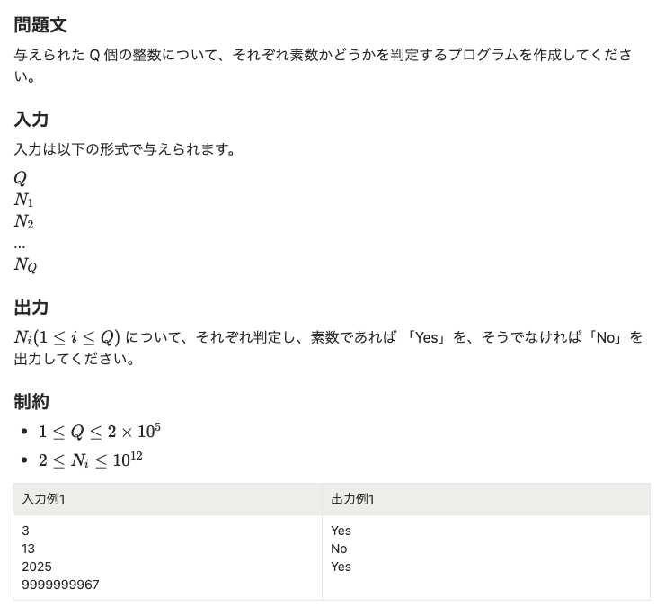
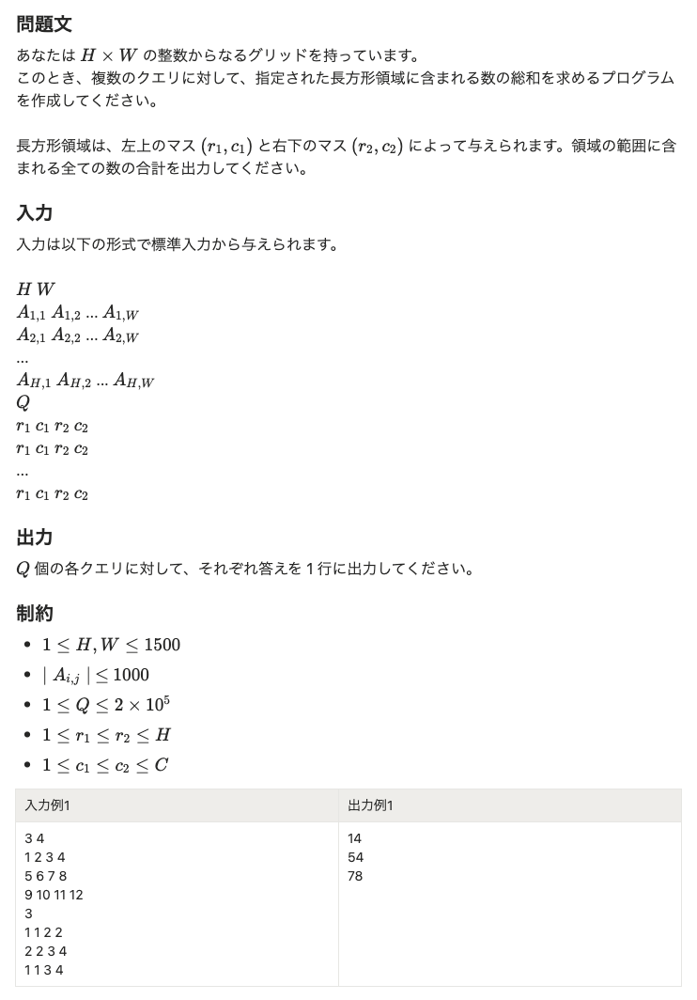
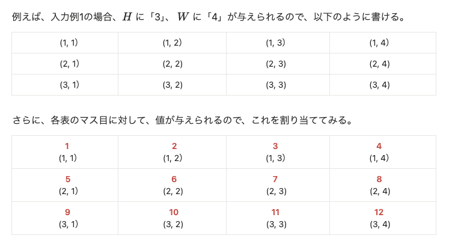

# 文系エンジニアがアルゴリズムの問題を解くときに 感じる「宇宙猫状態」のナゾを紐解いてみた

## はじめに

はじめましての方も、そうじゃない方も、こんにちは！
受託開発会社で Web エンジニアをしています、しゅとーです。

もともとは事務職として働いていましたが、VBA マクロを使った業務改善を行ったことがきっかけでエンジニアの世界に飛び込み、2年半が経ちました。

世はまさに大航海時代ならぬ「AI産業革命」の真っ只中で、技術記事や技術イベント、ニュースなどでも「AI」の文字を見ない日はありません。

弊社にもようやく遅咲きの AI の季節がやってきて、業務でも GitHub Copilot をはじめとした AI のお力を借りているわけなのですが、バリバリ仕事を任せすぎて、自分の脳みそが日々退化していっているような感じが否めなくなり、「基礎固め」兼「脳トレ」と称して、アルゴリズムの問題を解くようになりました。

しかし、1日1問のペースで問題を解くようになってまもなくのこと、私はある不思議な現象に見舞われはじめます。

そして、それはどうやら私だけではなく、アルゴリズムの問題に挑戦する人たち――とりわけ、算数・数学を苦手とする文系出身のエンジニアたちに、たびたび起こっている現象のようなのです。

今回はこの記事を通じて、アルゴリズムの問題を解くときに感じる、この不思議な現象のナゾを紐解いてみたいと思います。

## 「怪奇！ アルゴリズムの問題を解いていると起こるナゾの現象！？」を体感してみよう

百聞は一見にしかず、ということで、まずは実際にアルゴリズムの問題を解いてみましょう。

「**アルゴリズム（algorithm）**」は、簡単にいうと「**問題を解くための手順や方法**」のことで、この「**問題を解くためにいかに効率的な手順をとるか**」を解として求めるのがアルゴリズムの問題です。

問題は、おもに以下のような形式で出題されます。

もう一問、見てみましょう。

いかがだったでしょうか。

もし、この記事を読んでくださっているあなたが、今までアルゴリズムの問題に触れたことがなく、私と同じように算数・数学苦手民であったなら、今、あなたの脳内はこんなふうになっているはずです。

意識と思考は地球を離れ、果てしない銀河をえんえんと彷徨いつづけるーーいわゆる「**宇宙猫状態**」です。いったんこの状態に陥ってしまうと、もはや問題文を目で追っているのに、内容は頭に入ってきません。

アルゴリズムの問題に立ち向かうとき、多くの人が感じるこの思考停止状態は、いったいどこからやってくるのでしょうか。

## 「宇宙猫状態」の正体

ところで、この「宇宙猫状態」、なにもアルゴリズムの問題を解くときにだけ現れる、超不思議現象というわけではありません。

たとえば、

- 教科書や書籍で難解な数式に出くわしたとき
- はじめて Ruby on Rails でログイン機能を実装するとき
- 業務で全然知らない案件のコードをなるはやで修正しないといけないとき
- フレームワークやAWSの公式ドキュメントを読んだとき

などに、似たような経験をした方もいるのではないでしょうか。

心理学や脳科学の世界では、

「人は危機的状況や強いストレスにさらされると、**闘争または逃走反応（fight or flight response）**を示し、闘争も逃走もできなかった場合は、**思考停止**や**パニック状態**に陥る」

とされています。

なんだが、「宇宙猫状態」のときと似ていますね。

未知のものに遭遇したとき、**自分の処理能力以上の思考や行動を求められ、脳がパンクしてしまう状態**――これを「宇宙猫状態」の正体と考えると、原因はどうやら、脳の処理能力不足にあるようです。

## アルゴリズムの問題を解くとき、頭の中で起こっていることを紐解いてみる

もし、我々がSF世界の住人であったなら、「原因は脳の処理能力不足？ なら、脳のスペック上げればいいじゃーん」で、すぽーんと脳みそを交換するところですが、現実世界の人間はそういうわけにもいきません。

アルゴリズムの問題を解きながら、脳の処理能力を圧迫している要因をひとつひとつ地道に解きほぐしていく必要があります。

例えば、私の場合は、大きく分けて以下のような2つのパターンに分解することができました。
（以下はあくまでも私個人の分析結果ですが、算数・数学苦手民の文系エンジニアには当てはまるところも多いのでは⋯、と考えています）

### 宇宙猫パターン その1：問題文の内容が理解 or イメージできていない

アルゴリズムうんぬん以前に、「問題文を最後まで読んだのに、内容がぜんぜん頭に入ってこない⋯orz」となってしまうのが、このパターンの特徴です。

このパターンをさらに細かく分けると、以下のようになります。

**【算数・数学アレルギー由来の拒絶反応タイプ】**
- 問題文の「$N_i(1≤i≤Q)$」や「制約」などに含まれる変数名・数式の羅列に、拒絶反応が起こり、内容を理解する前に脳が思考停止状態に陥っている

**【アルゴリズムの問題 お初お目にかかりますタイプ】**
- 問題文ほか、「入力」「出力」「制約」の意図していることがわからない
- アルゴリズムの問題を解き慣れていない、もしくは、自分の処理能力よりも上の問題に当たったために、考え方がわからず、問題の内容がイメージできない

### 宇宙猫パターン その2：問題の解き方を知らない or 知識がない

上記パターンとは異なり、「言いたいことわかった。⋯で、このあとは？」となってしまうのが、このパターンの特徴です。

このパターンをさらに細かく分けた結果は、以下のとおりで、おもになにかしらの知識不足に起因しています。

**【根本的な算数・数学の知識不足タイプ】**
- 素数を求める問題の場合に、「そもそも『素数』がどういうものなのか、どうすれば求められるのか」を知らない

**【根本的なプログラミング言語の知識不足タイプ】**
- 入力された値の受け取り・出力に必要な関数もしくは記述方法を知らない
- 値の取りまわし方法や解法に必要な関数が思い当たらない

**【根本的なアルゴリズムの知識不足タイプ】**
- 解法に必要もしくは最適なアルゴリズムを知らない

アルゴリズムの問題に挑むとき、このような要因が複雑に絡み合い、手を変え品を変え、いっせいに目の前に飛び出してくるため、脳に急激な負荷がかかり、結果、思考は宇宙へと旅立ってしまうのです。

## アルゴリズムの問題解くとき、「宇宙猫状態」に陥らないためにできること

一口に「原因は『脳の処理能力不足』です」と言われてしまうと、お医者さんに「体調不良の原因は『自律神経』の問題ですね」と言われたときのような気分になってしまいますが、要因を小さく分けて考えれば、対処法も見えてきそうです。

ここからは、上記で紐解いた要因をもとに、脳への負荷を下げ、「宇宙猫状態」の抑制につながりそうな対策を効果のありそうなものから順に挙げてみたいと思います。

### 宇宙猫対策 その1：アルゴリズムの問題を解くことに慣れる

初っ端から身も蓋もないですが、アルゴリズムの問題であれ、プログラミングであれ、新しいことを身につけるには、当然ながら、**ある程度の慣れ**が必要です。

特にアルゴリズムの問題では、問題文の日本語の解釈方法のほか、どういう問題のときにどのようなアルゴリズムを使うのか、受け取った値をどのように取りまわすのかなど、応用の効くものが多いですし、頻繁に問題に触れる分、脳への負荷も軽減できるはずです。

ただ、初っ端から AtCoder のコンテストなど標高の高い位置からはじめてしまうと、難解な問題に当たりすぎて、「アルゴリズムキライ！」となってしまう危険性があるので、アルゴリズムに苦手意識がある方は、

- アルゴ式
https://algo-method.com/

- Python入門 AtCoder Programming Guide for beginners (APG4bPython)
https://atcoder.jp/contests/APG4bPython

- C++入門 AtCoder Programming Guide for beginners (APG4b)
https://atcoder.jp/contests/apg4b

など、比較的やさしい問題から、地道に登りはじめましょう。

また、問題を解くなかで出てきたアルゴリズムのうち、理解できないものがあれば、以下のような書籍をもとに深く理解すると、別の問題で出会ったときに「宇宙猫状態」に陥る状態がぐっと下がるはずです。
（特に「アルゴリズムとデータ構造」と「競技プログラミングの鉄則」は、ハチャメチャにおすすめです）

- 問題解決力を鍛える! アルゴリズムとデータ構造
https://www.amazon.co.jp/dp/4065128447

- 競技プログラミングの鉄則 〜アルゴリズム力と思考力を高める77の技術〜
https://www.amazon.co.jp/dp/483997750X

- 問題解決のための「アルゴリズム×数学」が基礎からしっかり身につく本
https://www.amazon.co.jp/dp/4297125218

### 宇宙猫対策 その2：問題に出てくる変数や処理に具体的な形を与えてイメージしやすくする

もし、あなたがアルゴリズムの問題を解いていくなかで、問題の解決に最適なアルゴリズムを考える以前に、問題文の理解で撃墜されることが多いのであれば、

「**『どういう処理が行われるのか』『どういう値が入ったらどうなるのか』を認識しやすくするため、手書きで処理や図を書いてみる**」

と、問題の内容を理解しやすくなるかもしれません。

例えば、「宇宙猫状態」の体験のために挙げた2つ目の問題の場合、入力例の値や桁の少ない具体的な値を与えて、実際に表をつくってみます。

このようにしてみると、問題文を目で追っているだけのときよりも脳の負荷がぐっと下がったのではないでしょうか。

また、問題を解きおわったあとに、「解答を見たけど、解答の意味がわからない⋯」となる場合も、変数に具体的な値を当てて、処理の流れを追ってみると理解しやすくなるはずです。

### 宇宙猫対策 その3（オプション）：算数・数学アレルギーを緩和する

算数・数学苦手民にとって、なによりも天敵なのは、**抽象的な変数名**や**数式の羅列**です。
極度の算数・数学アレルギー持ちの方なら、問題文の「入力」や「制約」の箇所を見るだけでも、意識が遠くなってしまうのではないでしょうか。

しかし、アルゴリズムの問題では、抽象的な変数名・数式の羅列はかならず登場しますし、「『素数』の値を求めよ」などのように算数・数学の基礎的な知識がないと解けないものもあります。

対策その1で挙げたように、ある程度の知識はアルゴリズムの問題を解くだけでも身につけることはできますが、もしあなたが、

- 問題文の変数名や数式の羅列を見た時点で思考停止している
- 「算数」や「数学」という言葉に、過去の苦々しい体験が走馬灯のように思い起こされる
- ことあるごとに、「所詮、自分は文系エンジニアだから⋯」という言葉が頭をよぎる

のであれば、この**算数・数学アレルギー**こそが**「宇宙猫状態」を引き起こしている根本的な原因**かもしれません。

特にエンジニアの方であれば、技術を突き詰めていけばいくほど、算数・数学の知識が必要な場面にかちあう日はいつか必ずやってくるので、この機会にアレルギーを緩和して、抽象的な変数名や数式に出くわしたときのストレス値を下げておくのもおすすめです。

算数・数学まわりは、以下の書籍が図解が多く、とても丁寧でわかりやすいです。

- 東大の先生！ 文系の私に超わかりやすく数学を教えてください！
https://www.amazon.co.jp/dp/B07MT7ZVXK

- 東大の先生！ 文系の私に超わかりやすく高校の数学を教えてください！
https://www.amazon.co.jp/dp/4761275014

- 東大の先生！ 文系の私に超わかりやすく算数を教えてください！
https://www.amazon.co.jp/dp/4761277521

また、以下は子ども向けですが、読むと算数・数学がちょっとだけキライじゃなくなります。

- 普及版 数の悪魔――算数・数学が楽しくなる12夜
https://www.shobunsha.co.jp/?p=1008

## おわりに

プログラミング言語・フレームワーク・開発手法・エディタなど、技術の流行り廃りが激しいエンジニアの世界にはさまざまな思想があり、SNS では日々、この手の「宗教戦争」とも呼べるような戦いが絶えず繰り広げられています。

しかし、こと「アルゴリズム」という分野に関しては、人によって意見や考え方が本当にまちまちで、

「絶対必要！ 言語とかフレームワークとかの前にまずアルゴリズムでしょ」

という方もいれば、

「実務でまずお目にかかることがないし、アルゴリズムってそんなに必要？」

という方もいますし、なかには、

「アルゴリズムか⋯」

と、そっと目を逸らして、遠くを見つめはじめる方もいたりします。

私自身、アルゴリズムを学ぶことの重要性に気づかされたのはごく最近で、AI の早すぎる進化の荒波を前に、「技術をもっと身につけたい、できるようになりたい。でも、なにから始めたらいいかわからない」と、半ば焦燥感のような感覚に苛まれるようになってからのことでした。

最新の AI をキャッチアップするか、実務で使えそうなインフラまわりの知識を身につけるか、それとも基本情報を勉強するべきか――スキルを磨くためにベストな一歩を探しあぐねるなかで、なんとなく読み始めた「問題解決力を鍛える! アルゴリズムとデータ構造」に書かれていた以下の言葉に、すとんと腹落ちさせられたのを今でも覚えています。

> しかし, 私は, ソフトウェアエンジニアリングやコンピュータ科学に携わるあらゆる技術者は, まずはアルゴリズムの基礎をしっかり押さえるべきだと断言します.そもそも「アルゴリズム」は, 「人工知能」や「量子コンピュータ」と並列して語るべきキーワードではありません。人工知能に取り組むにせよ, 量子コンピュータに取り組むにせよ, 本書で学ぶアルゴリズムや計算量理論の基礎への理解は必要になります.そして, 移り変わりが激しい分野の知識と異なり, アルゴリズムの基礎は「一生モノ」としてどんな分野に取り組むにしても下地や強みとなります.[^1]

[^1]: 大槻兼資著, 秋葉拓哉監修, 問題解決力を鍛える! アルゴリズムとデータ構造, 2020, p.3.

この記事を通じて、私と同じようにアルゴリズムに苦手意識を感じる方が、ちょっとでも「アルゴリズムの問題、やってみようかな」という気持ちになってくれたら、そして、「こんな記事を書いたんだから、アルゴリズムもアルゴリズムの問題もちゃんと理解できるようにならないとね」という締め切り駆動開発のような自戒の念をこめつつ、この記事を終わりたいと思います。

ここまで読んでいただき、ありがとうございました（ФωФ!!）

## 参考資料
- 問題解決力を鍛える! アルゴリズムとデータ構造
https://www.amazon.co.jp/dp/4065128447

- 競技プログラミングの鉄則 〜アルゴリズム力と思考力を高める77の技術〜
https://www.amazon.co.jp/dp/483997750X

- プログラマー脳 ～優れたプログラマーになるための認知科学に基づくアプローチ
https://www.amazon.co.jp/dp/4798068535

- 心理学用語の壁 > 闘争-逃走反応
https://hosomegane.com/psychology/2024/08/15/fight-or-flight/
