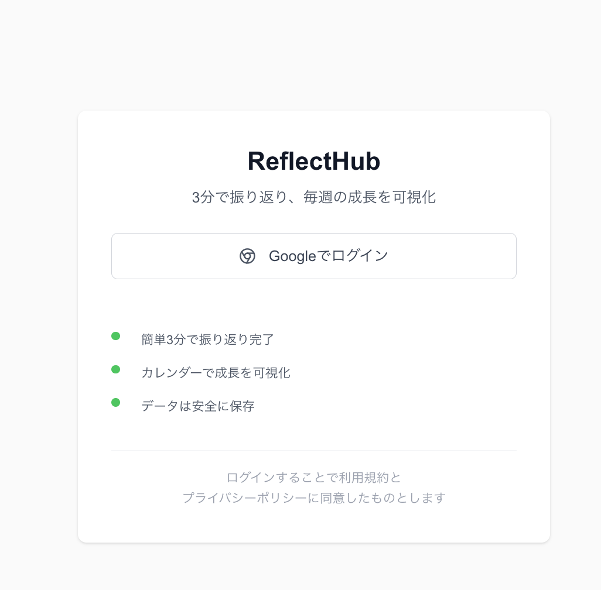
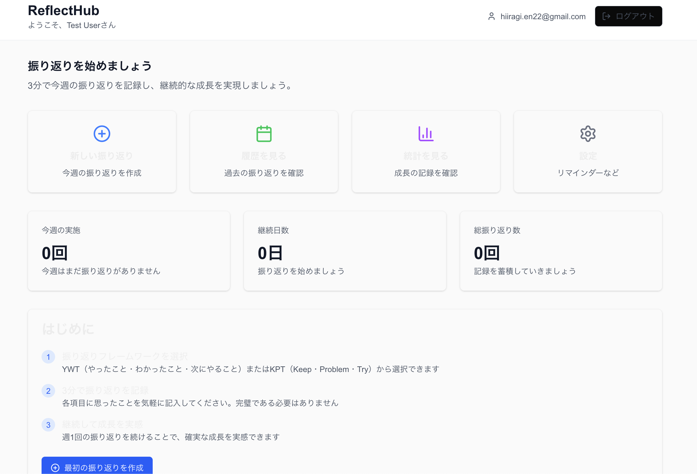

# 振り返りを習慣化させるアプリ、「ReflectHub」をSupabaseとNext.jsで作成してみる。

## 始めに

皆様は振り返りを定期的に行っていますでしょうか。
振り返りは、過去の自身の行動や判断を客観的に見直し、
改善点や反省点を見つけることで、今後の動きをより良くするためのものです。
振り返りに使うものとしてKPTやFun/Done/Learnなどの、
フレームワークを使用して行っている方もいらっしゃるのではないでしょうか。
筆者は、KPT(最近はYWT)を毎週金曜日に行うようにしています。
Googleカレンダーにも予定を入れています。
しかしよく振り返りを忘れてしまい、
金曜日以降に行ったり、
2週間分をまとめて行ったりしてしまいます。
また振り返るのは良いものの、それを役立てられているかも分かりません。
そこで簡単に習慣化できるようリマインドをしてくれて、
後々AIで振り返りを分析できる機能を持ったアプリを作成することにしました。

また今回のアプリの名前は、
わざと技術記事のテーマの一つの"Hub"があるから使用したのではなく、
偶々AIとアプリ名を壁打ちしていて決まったものでした。
「内省や振り返りの中心地」という意味が込められているのですが、
今回の同人誌の名前と似たようなコンセプトに、
意図せずなっていました。
そのため折角ならこのアプリで記事を書こうと思いました。

※注意
この記事を書いた時点では、まだこのアプリをリリースできていません。
この同人誌が発行されている時点では、リリースできていることを切に願います。。

## 主な使用技術

### フロントエンド技術

- フレームワーク・ライブラリ
    - Next.js 15.5.2 (React フレームワーク)
    - React 19.1.0 / React DOM 19.1.0
    - TypeScript 5.9.2

- UI・スタイリング
    - Tailwind CSS 4.1.12
    - Radix UI (@radix-ui/react-slot)
    - Lucide React 0.542.0 (アイコンライブラリ)
    - class-variance-authority (CSS クラス管理)
    - clsx / tailwind-merge (クラス名管理)

### バックエンド・API
- チャットボット・AI
    - LINE Bot SDK 10.2.0
    - OpenAI 5.16.0

- データベース
    - Supabase 2.56.0 (認証、データベース、リアルタイム)

- 状態管理・データフェッチ
    - TanStack React Query 5.85.5
    - Zustand 5.0.8 (状態管理)
    - Axios 1.11.0 (HTTP クライアント)

[GitHubのリポジトリリンク](https://github.com/hiiragi17/ReflectHub
)

## Supabaseを選んだ理由

今回バックエンドにはSupabaseを選びました。
理由には以下のものがあります。
- 完全無料でスタートできる
    - 今回は個人開発であるため、できるのなら本番環境を無料で使えるものが良いと考えました。フロントはNext.jsなため、Vercelを使用しています。
- Google/LINE認証が簡単に実装できる
    - 手軽にログインできることで、振り返りのハードルを下げたいと考え、
    パスワード認証は行わないようにしたいと考えています。
- PostgreSQLが使用できるので、分析・集計に強い
    - AIでデータ分析がしやすいようにしたいと考えました。

Firebaseも候補にありましたが、
NoSQLなため将来的なデータ分析や複雑なクエリを考えると、
リレーショナルデータベースのSupabaseの方が扱いやすいと考えました。

## Supabaseの設定方法

### 環境構築に関して

Supabaseの環境構築はそんなに難しくないです。
Supabaseの公式サイトにアクセスし、プロジェクトを作成し、
パッケージのインストールを行った後、
環境変数を設定します。
またGoogleログインを実装したい場合は、
Google OAuthアプリケーションの設定が必要です。
Google Cloud Platformにアクセスを行い、こちらでもプロジェクトを作成しましょう。
下記記事の流れがわかりやすかったので、
私は下記の記事を参考にして環境変数の登録等を行いました。

https://qiita.com/kaho_eng/items/a37ff001ea9eae226183

### Row Level Security(RLS)設定に関して

普段バックエンドの開発をしているため、
フロントエンドからAPIを介して、データベースにアクセスしています。
しかしSupabaseの場合はフロントエンドから直接データベースにアクセスするため、
コードで権限チェックをするのではなく、**Row Level Security(RLS)**
というものを利用する必要があるのですが、最初この考え方に慣れませんでした。

### RLSとは

RLSは実際にはPostgreSQLの標準機能になります。
Supabaseがこれを活用している理由は下記になります：

- 直接データベースにアクセス: フロントエンドから直接PostgreSQLにアクセスできます
- セキュリティの最後の砦: どんなクエリでも必ずRLSポリシーが適用されます
- 統一された権限管理: すべてのテーブルアクセスが同じルールに従います

RLS を利用するためには、作成した任意のテーブルにおいて RLS を有効化して、
Row Security Policies を作成する必要があります。

今回RLSを設定するのは、
プロフィールとユーザーの設定テーブルになります。
その場合のRLSの設定例は下記のようになります。
```
-- テーブルでRLSを有効化
ALTER TABLE profiles ENABLE ROW LEVEL SECURITY;
ALTER TABLE user_settings ENABLE ROW LEVEL SECURITY;

-- profiles: 全員が閲覧可能、本人のみ編集可能
CREATE POLICY "Public profiles are viewable by everyone" 
    ON profiles FOR SELECT 
    USING (true);

CREATE POLICY "Users can update own profile" 
    ON profiles FOR UPDATE 
    USING (auth.uid() = id);

CREATE POLICY "Users can insert own profile" 
    ON profiles FOR INSERT 
    WITH CHECK (auth.uid() = id);

-- user_settings: 本人のみ全操作可能
CREATE POLICY "Users can manage own settings" 
    ON user_settings FOR ALL 
    USING (auth.uid() = user_id);
```

このようにすることで、
不正ログインやユーザーの設定を、本人以外ができないようにしています。

## Zustandでの状態管理

ユーザーのログイン状態を管理するために、
今回はZustandを用いて実装しています。

### Zustandとは
ご存知の方も多いかもしれませんが、念の為説明させていただきますと、
Zustandは、Reactアプリ向けの軽量でシンプルな状態管理ライブラリです。 
そのAPIはReactフックにもとづいており、直感的に扱える設計が特徴です。 
初心者でも簡単に導入できるため、初めての状態管理ライブラリとしても適しています。

### 状態管理ライブラリとは
状態管理ライブラリとは、 
アプリ内で使用されるデータ（状態）を効率的かつ一元的に管理するためのツールです。

状態とはアプリの「現在の状況」を表すものです。 
「状態（state）」とは、アプリが「今どんな状況にあるか」を示すデータのことです。 
例えば、以下のようなデータが状態に該当します。

- ユーザーのログイン状態
- ショッピングカートに入っている商品
- フォームに入力されたテキスト

これらの状態は、ユーザーの操作によって頻繁に変化します。
 適切に管理することで、アプリの動作がスムーズになり、 
 ユーザー体験を向上させることができます。

### 実際のコードでの状態管理

### 基本的なZustandストアの作成
Zustandではcreateメソッドを使って状態管理ストアを作成できます。
set()で状態を更新し、get()で現在の状態を参照できます。

```
import { create } from "zustand";

interface AuthStore {
  user: User | null;
  isLoading: boolean;
  isAuthenticated: boolean;
  error: string | null;
  
  signIn: () => Promise<void>;
  signOut: () => Promise<void>;
}

export const useAuthStore = create<AuthStore>()((set, get) => ({
  // 初期状態
  user: null,
  isLoading: false,
  isAuthenticated: false,
  error: null,
  
  // アクション
  signIn: async () => {
    set({ isLoading: true, error: null });
    // ログイン処理...
  },
  
  signOut: async () => {
    set({ 
      user: null, 
      isAuthenticated: false,
      isLoading: false 
    });
  }
}));
```

### Persistミドルウェアによる永続化
persistミドルウェアを使うことで、状態をlocalStorageに自動保存できます。
```
export const useAuthStore = create<AuthStore>()(
  persist(
    (set, get) => ({
      // ストアの実装...
    }),
    {
      name: "auth-store", // localStorageのキー名
      partialize: (state) => ({ 
        // 永続化したい項目を選択
        user: state.user,
        isAuthenticated: state.isAuthenticated
      }),
    }
  )
);
```

管理している状態は下記になります。
```
{
  user: null,               // ログインユーザーの情報
  isLoading: false,         // 認証処理中かどうか
  isAuthenticated: false,   // ログイン済みかどうか
  error: null,             // 認証エラー情報
}
```

このような設定を行い、下記のようなログイン画面を実装し、

Googleログインとログイン状態の管理が簡単にできるようになりました。
そのうちLINE認証も行う予定です。
なるべくすぐに振り返りができる！
をコンセプトにしているため、
ログイン画面とかデザインはシンプル目にしています。

また一応ログイン後のダッシュボード画面が下記になります。

またこれらの画像は開発中のものであり、変更される可能性があります。

※肝心の振り返り機能の実装はまだ出来ていません。。
11月にはきっと実装されている筈です。
追加の機能に関しては、またどこかで記載できればと思っています。

## まとめ

正直まだ世の中に出せていないアプリについての記事を書いているのは、
色々とダメな気がしますし、
何よりSupabaseとZustandの触りしか、
載せられていない記事になってしまいました。
ただこの記事が誰かのアプリ作成の参考になれば幸いです。

## 参考文献

この記事は以下の記事を参考にして執筆させていただきました。

- https://qiita.com/kaho_eng/items/a37ff001ea9eae226183
- https://zustand-demo.pmnd.rs/
- https://qiita.com/s_taro/items/0c16f077d843ac1a78fa