# 文字化けから学ぶ、文字コード

## 1. はじめに: なぜ今、文字コードを学ぶのか？

筆者は現在30代前半ですが、昔は文字化けしたホームページを見て「なんだこれ！」と思ったものです。

今ではほとんど見かけなくなりましたが、Webエンジニアになりシステム開発や保守をしていると、文字化けの修正や文字コードの考慮が必要になる場面があります。

文字コードは日常的に意識するものではないため、何か問題が発生してから調べて解決することが多いものです。しかしそれでは断片的な知識で不十分だと感じ、改めて体系的に学び直しました。今回はその学びをご紹介します。

**AIがコード生成やレビューを担い始めた2025年現在においても、Webエンジニアにとって文字コードの基礎知識は不可欠だと思います。**

言語やフレームワークを超えたWeb知識の土台として、文字コードについて一緒に学んでいきましょう！

## 2. 文字コードの基本を理解する

### 文字化けとは何か？

文字化けとは、テキストが正しく表示されず、意味のない記号や文字の羅列として現れる現象です。

{style="width:100%;"}

この現象は、**テキストを保存した際の文字コードと、表示する際に使用される文字コードが一致しない場合に発生**します。
例えば、UTF-8で保存されたテキストをShift-JISとして読み込もうとすると、文字化けが起こります。

画面であれば表示ですぐにわかりますが、実際にはWebシステムの様々な箇所で文字コードが関係します。

### 文字コードが関係する箇所

では、いったいどこで文字コードが関係してくるのでしょうか？

「体系的に学ぶ 安全なWebアプリケーションの作り方」(技術評論社)の第6章「文字コードとセキュリティ」の図を引用します。

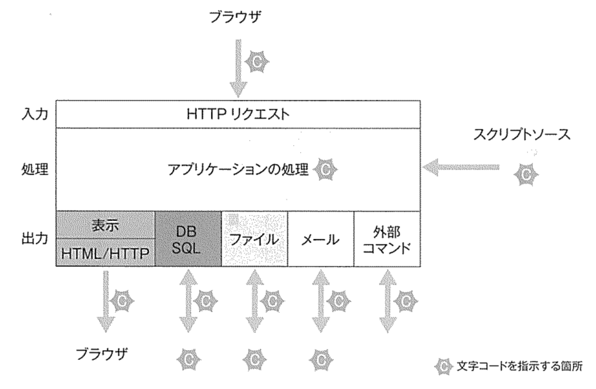

いかがでしょう、文字コードを考慮すべきところは、実は多く存在することが分かります。

**端的にいえばシステムの境界では文字コードの考慮は必須です。**

デフォルトがUTF-8またはUTF-8互換のものが増えたため問題になることは昔に比べ減っているそうです。しかしシステムの設計段階から文字コードを意識することは重要です。

### 文字コードの定義 - 文字集合と文字エンコーディングの違い -

ここで、文字コードについて定義します。

文字コードとは、「文字集合」と「文字エンコーディング」の２つの概念を含んだ用語です。

実際には「文字エンコーディング」のみをさしている場合も多くあります。

#### (1) **文字集合**

あいうえお表はひらがなを集めた一つの文字集合といえます。

カタカナ、アルファベット、漢字、その他言語など、様々な文字集合があります。
それらの文字を寄せ集め一意になる番号（コードポイント）を割り振ったものが、文字集合です。文字セット、キャラクタセットとも言います。

例えばJIS X 0208という文字集合は日本語の文字集合で、`あ`は`0x2422`、`ア`は`0x2521`、`A`は`0x2130`と番号が振られています。

また、Unicodeという文字集合は世界中の文字を一つにまとめたものです。`あ`は`0x3042`、`ア`は`0x30A2`、`A`は`0x0041`といった番号が振られています。

つまり文字集合とは「どんな文字をどれだけ使えるか」を表す表と捉えておきましょう。

- 補足1: `0x`は16進数であることを示すプレフィックスです。例えば`0x2422`であれば`2422`が16進数であることを示します。16進数から2進数への変換は簡単で、`2`は`0010`, `4`は`0100`です（指で覚えておきましょう）ので、データの実態は`00100100 00100010`という2バイト・16ビットとなります。

#### (2) **文字エンコーディング**

**文字集合のコードポイントをバイト列（バイナリデータ=情報の全ては0か1で表される）に変換するためのルール**が文字エンコーディングです。文字符号化方式、符号化方式とも言います。

例えば、Shift-JISはJIS X 0208の文字集合をバイト列に変換するための文字エンコーディングです。`あ`は`82 A0`、`ア`は`83 40`、`A`は`41`とバイト列になります。

また、UTF-8はUnicodeの文字集合をバイト列に変換するための文字エンコーディングです。`あ`は`E3 81 82`、`ア`は`E3 82 A2`、`A`は`41`とバイト列になります。

- 補足2: `E3 81 82`も16進数表記です。10進数の10から15をアルファベットのAからFで表し、`16`で繰り上げて`10`とします。2進数に変換すると`11100011 10000001 10000010`の3バイト・24ビットとなります。

昔のコンピュータは扱える情報量が現在と比べると非常に少なく、ハードの制約もあり、メーカーが独自に文字コードを策定したり拡張したりしていました。

そのため様々な文字集合があり、文字エンコーディングも多様化しました。

### 主要な文字コードの種類

そんな数ある文字コードの中で、実務上は以下の4つを押さえておけばよいと思います。

| エンコーディング方式 | 対象文字 | バイト長 | 特徴など |
|:-----------|------------:|:------------:| :------------|
| ASCII（アスキー）       | 英数字、記号 | 1バイト | コンピュータの基本となる文字コードであり、すべての文字コードの基盤。URLの％エンコーディングはASCIIを基にしている。|
| Shift-JIS   | 日本語、英数字、記号 | 1〜2バイト  | 日本語を扱うために作られた文字コード。ASCII互換。Windowsで広く使われており、現在はあまり推奨されない...はずだが、ExcelはいまだにデフォルトでShift-JIS...|
| UTF-8       | 世界中の　文字 | 1〜4バイト        | 現在の主流。ASCII互換。世界中の文字を統一的に扱うことができ、Webやプログラミング言語で広く使われている。日本語は3バイトで表現されることが多い。|
| UTF-16      | 世界中の　文字 | 2〜4バイト | Unicodeの直系。完全なASCII互換ではないため、UTF-8が優先される。Webではあまり使われないが、Javaの内部処理で利用される。|

このほか、EUC-JP、ISO-2022-JP、UTF-32などがありますが、実務上はあまり見かけません。これらは必要な時に調べる形で良いと思います。

## 3. 文字化けさせてみよう

### 5分ハンズオン！

文字化けを意図的に再現することで、理解を深めましょう。

VSCodeを使用しますが他のテキストエディタでも同じ検証は可能です。

**手順:**

ローカルで任意のファイルを作成し「あ」の文字を入力し保存します。

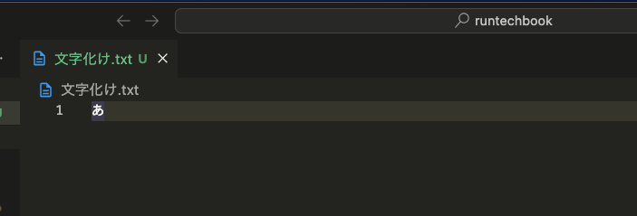

右下を見ると、現在の文字コードはUTF-8が使用されていることが分かります。

{style="width:95%;"}

この「UTF-8」をクリックすると、文字コードを変更することができます。

「エンコード付きで再度開く」を選択します。

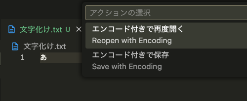{style="width:95%;"}

Shift-JISに変更してみましょう。

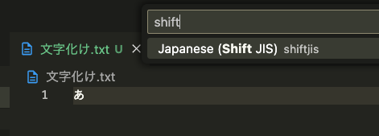{style="width:95%;"}

すると...

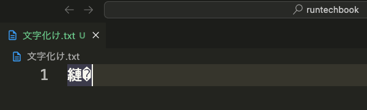{style="width:95%;"}

はい、文字化けしました。簡単ですね！

### ファイルはただのバイト列である

このように、ファイルの中身は一切変更せず、エディタの文字エンコーディングを変えるだけで文字化けは再現可能です。

つまり**ファイル自体はただのバイト列で0と1の組み合わせでしかなく、文字コード情報は持ち合わせません。**

エディタで指定した文字コードでバイト列を読んだり書いたりしているだけ、というのが実態です。シンプルですね。

ちなみにUTF-8→Shift-JISの文字化けは糸偏の漢字が多いのが特徴です。（覚えておくと良いかも？）

### （応用）バイナリエディタでバイト列を確認する

ファイルに保存されている0と1の組み合わせ、つまりバイト列を確認するにはバイナリエディタを使います。

有名なのはStirling（スターリング）ですが、実はVSCodeの拡張機能「**Hex Editor**」を使えばすぐにバイト列を確認できます。

**手順:**

VSCodeの拡張機能で「Hex Editor」を検索しインストールします。

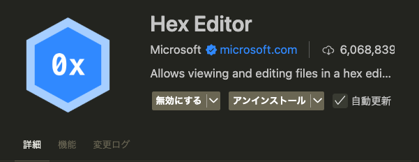

インストール後、VSCodeで先ほどの文字化けしたファイルを開き、右クリックメニューから「エディターを再度開くアプリケーションの選択」→「16進数エディター」を選択します。

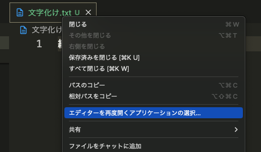

すると、バイト列が16進数で表示されます。

UTF-8で保存された`あ`は`E3 81 82`と3バイトで表現されます。

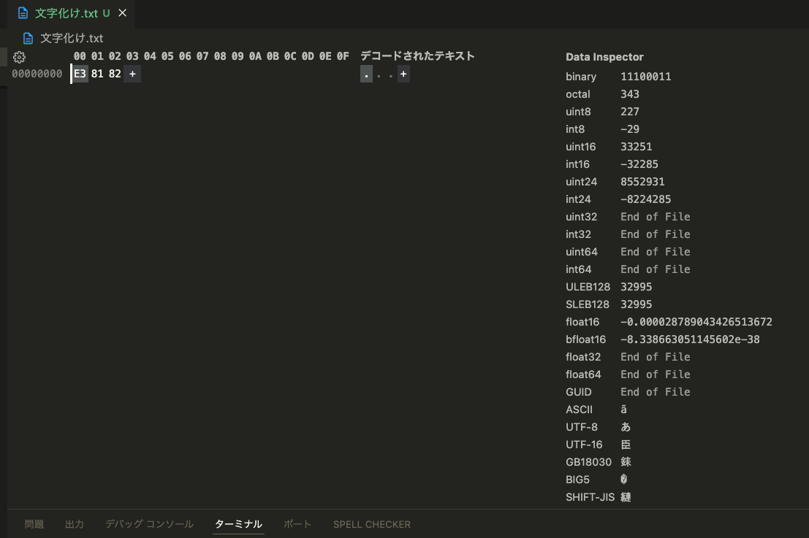

Shift-JISで読み込むと、同じバイト列は全く別の文字として解釈され、結果として文字化けが発生します。

普段開発しているプログラミング言語のソースコードも、結局はこのようなバイト列の集まりです。お手元のファイルをバイナリエディタで開いてみてくださいね。

### （さらに応用）文字集合・文字エンコーディングの関係

ここまでの説明を踏まえて、ファイルの読み書きを開発者が行ったケースを図示します。

**ファイルの書き込み**

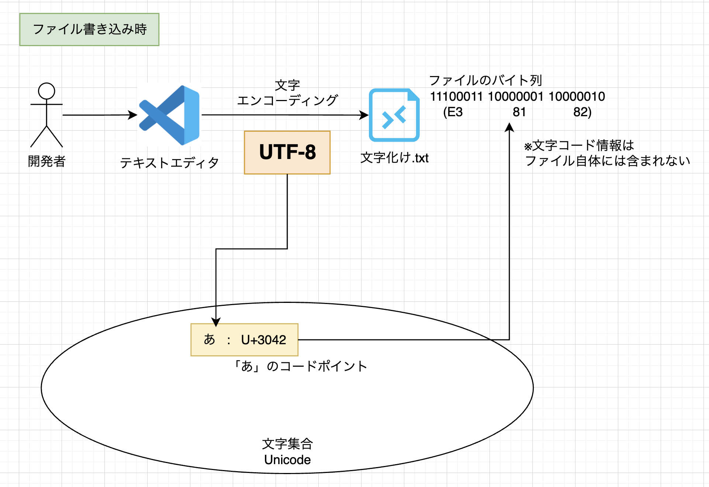

**ファイルの読み込み(Shift-JIS文字化け)**

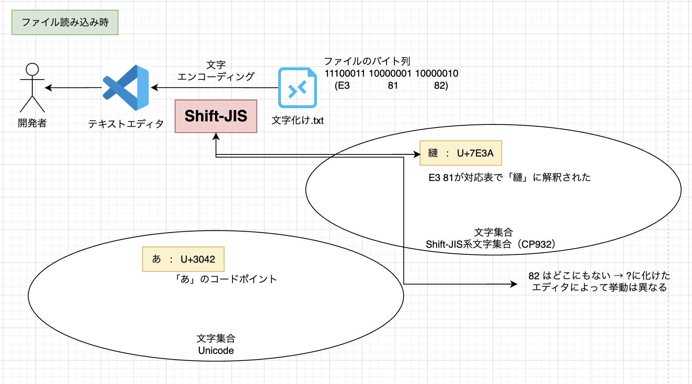

クライアントが開発者でなくても、APIやDB、CSVなど様々な箇所で起きている事象の根本は同じです。

だから**UTF-8に統一してしまうのが一番楽で安全だ**、ということですね。

以上が文字集合・文字エンコーディングの関係です。

## 4. プログラミングにおける文字コードの落とし穴

少々脱線しました。ここからは実務でよくあるケースをご紹介していきます。

### (1) CSV入出力

最も一般的な問題の一つが、CSVファイルに関連するものです。

Excelは、日本語環境ではShift-JISをデフォルトとして想定することが多いです。そのため、**UTF-8で保存されたCSVファイルをそのまま開くと、文字化けが発生するケースがかなり見られます。**（開発者がMacでも、ビジネスユーザーがWindowsでExcelを使うことが多い）

CSVファイルをExcelで正しく開くためには、・エンコーディングを明示的に指定して開き直す、・BOM付きUTF-8で保存する、・特定のシステム連携（SFTPなど）では意図的にShift-JISで保存する、といった方法があります。（後述しますがBOM付きUTF-8はお勧めしません）

ユーザー操作に影響するため、実装方針の調査と担当者間の認識合わせは怠らないようにしましょう。

### (2) MySQLの文字コード

MySQLの文字エンコーディング設定には、`utf8`と`utf8mb4`の2つがあります。

`utf8`は3バイトまでの文字をサポートし多くの言語をカバーしています。しかし、4バイト文字を扱うことができません。**つまり絵文字（や特殊文字）が文字化けします。**

一方`utf8mb4`は4バイト文字までサポートし、Unicodeの全範囲をカバーできます。絵文字や多言語対応も考慮すると、`utf8mb4`が推奨されています。

執筆時点のstable版であるMySQl 8.4系はデフォルトで`utf8mb4`が適用されるためあえて変更する必要はありませんが、MySQL5.7系はlatin1がデフォルトでした。そのためバージョンアップの際は`utf8`ではなく`utf8mb4`に変更することが必須です。

MySQLに限らず、**システムのバージョンアップ時に文字コードの調査確認は必須である**と理解しておくと良いかなと思います。

### (3) BOMとエンディアン

BOM（ボム）とは、**Byte Order Mark**の略で、Unicodeテキストファイルの先頭に付与される3バイトの目印です。

主にUTF-16またはUTF-32でバイト順（エンディアン）を判別するために使われます。

UTF-16とUTF-32では最小単位が2バイトまたは4バイトであるため、バイトの並び順（=エンディアン）が重要です。

2バイトの場合、`0x1234`は**ビッグエンディアン**（最初から順に解釈）では`12 34`、リトルエンディアン（最後から順に解釈）では`34 12`と表現されます。

VSCodeの文字エンコーディングで**UTF-16 BE（Big Endian）**、**UTF-16 LE（Little Endian）**があるので、違いを検証してみると良いと思います。

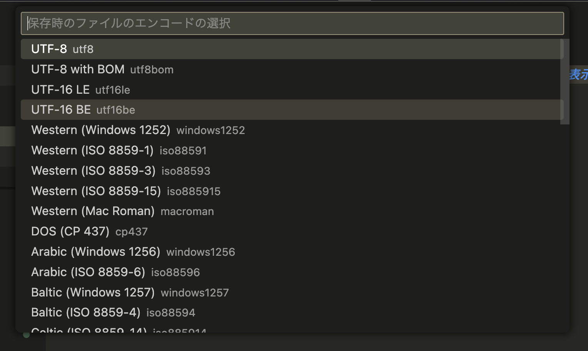

また一番普及率の高いUTF-8でも、BOMを付与することができます。

本来、UTF-8は1バイト単位で文字を扱えるためエンディアンの概念は**不要**なのですが、BOMを付与することで**ファイルがUTF-8でエンコードされていることを示す目印**となります。

BOMが付いていることでExcelの自動判定で正しくUTF-8として認識され、文字化けを防ぐことができます。

しかし、BOM付きで保存されたファイルをBOMを想定していないプログラムで読み込むと、先頭に余分なバイト列が挿入されることになり、パースエラーやコンパイルエラーの原因となります。

また、プログラミング言語処理以外でも、以下のファイルもBOM付き保存すると高確率でエラーになります。

- **鍵ファイル**
  - 公開鍵（.pub）、秘密鍵（.pem, .id_rsa）
- **INI形式ファイル（セクションとキー = バリューのペアで構成される）**
  - .ssh/config、.aws/credentials、php.ini、nginx.confなど

バイナリでファイルを開かない限り開発者にもBOMは見えないため、エラーの原因特定が難しくなりがちです。

特に鍵ファイルをBOM付き保存したSSH失敗は非常に厄介です😭 。。

鍵の内容がテキスト上正しく、パーミッション設定に問題はなく、SSHコマンドでホスト名なども一切間違っていないのに「Permission denied」となるためです。

なので**BOMなしUTF-8でファイルを扱うのが一般的かつトラブルも少ないです。**

<u>よほどの理由がない限り、BOM付きをあえて実装したりファイル保存したりする必要はなさそうです</u>、、意図しないBOMの付与には十分に気をつけましょう。

## 5. 改行コードに注意 - Mac/Windows/Unix混在開発では改行コードの統一も重要 - 

最後に、文字コードに関連して改行コードもOSやシステム間でテキストファイルをやり取りする際に問題を引き起こしやすいです。

改行コードとは、テキストの行末を識別する特殊な制御文字（目に見えない文字）の一つです。主要な改行コードには以下の3つがあります。

| OS名 | 改行コード | 文字リテラル | 特徴 |
|:-----------|------------:|:------------:| :------------|
| UNIX系、macOS、iOS | LF (1文字) | \n | UNIX系のOS（LinuxやmacOS）で主に使用される1文字のコード。|
| Windows | CRLF (2文字) | \r\n | Windowsで主に使用される2文字の組み合わせ。タイプライター（CR: キャリッジリターンで印字位置を行頭に戻し、LF: ラインフィードで紙を1行送る）の動作に由来している。|
| 旧来のMac OS | CR (1文字) | \r | 旧来のMac OSで使用されていた1文字のコード。現在はほとんど使われていない。|

ポイントは、MacとWindowsで改行コードが異なる点です。

それゆえに**共同開発でソースコードを共有する際に改行コードの違いが原因でバグが発生することがあります。**

実際、改行コードの混在が原因でDockerコンテナが起動せず新規メンバーの環境構築に失敗したことがあり、原因の特定に苦労しました。

プロジェクトで使用する改行コードは統一し、Gitで改行コードの自動変換を設定することが推奨されます。(core.autocrlf)

下記記事は図も豊富で非常に分かりやすいので、ぜひコメント欄含めてご一読ください。

[気をつけて！Git for Windowsにおける改行コード(Qiita)](https://qiita.com/uggds/items/00a1974ec4f115616580)

## 6. おわりに

本記事の要点は以下になります。

- 文字化けは、保存時と読み込み時の文字コードが一致しない場合に発生する
- 文字コードは「文字集合」と「文字エンコーディング」の2つの概念を含む用語だが、一般的に「文字エンコーディング」を指すことが多い
- 主要な文字コードはASCII、Shift-JIS、UTF-8、UTF-16などがあり、実務上は**UTF-8に統一するのがベストプラクティス**
- プログラミングにおける文字コードの落とし穴として、CSV入出力、MySQLの文字コード設定、BOMの扱いなどがある
- Mac/Windows/Unix混在開発では改行コードの統一も重要

このほか文字コードにおけるセキュリティについては触れていません。興味のある方は「体系的に学ぶ 安全なWebアプリケーションの作り方」(技術評論社)をぜひご一読ください。

また文字コードの歴史や詳細な技術的背景について興味ある方は、「プログラマのための文字コード技術入門」(技術評論社)をご一読ください。

## 7. 参考資料

- [安全なWebアプリケーションの作り方(技術評論社)](https://wasbook.org/)
{style="width:30%;"}

- [プログラマのための文字コード技術入門(技術評論社)](https://gihyo.jp/book/2019/978-4-297-10291-3)
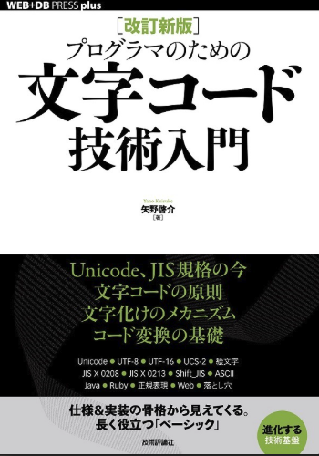{style="width:30%;"}
- [とほほの文字コード入門](https://www.tohoho-web.com/ex/charset.html#charset_and_encoding)
- [文字コードとは何か？基礎知識を1分でわかりやすく](https://it-biz.online/it-skills/character-code/)
- [バイナリエディタ使ってみる(Qiita)](https://qiita.com/shupeluter/items/b084a8cbb63f8e65dc6e)
- [Unicode ～エンディアンとBOM～](https://una.soragoto.net/topics/10.html)
- [バイトオーダマークとは｜「分かりそう」で「分からない」でも「分かった」気になれるIT用語辞典](https://wa3.i-3-i.info/word11430.html)
- [MySQLの文字コード変更完全ガイド｜utf8mb4への移行方法とトラブル対策](dbtech.digibeatrix.com/mysql/server-config/mysql-change-charset-utf8mb4/)
- [改行コードの種類と基本(Qiita)](https://qiita.com/gts/items/5bae62d2b57a4a6d4221)

--- 

お読みいただきありがとうございました。以下で発信していますので、よろしければフォローお願いします。

{style="width:10%;"}
[X(@Toshiki@Web系エンジニア)](https://x.com/abc3_toto)

[note](https://note.com/toshiki003)

[Zenn](https://zenn.dev/toshiki003)
